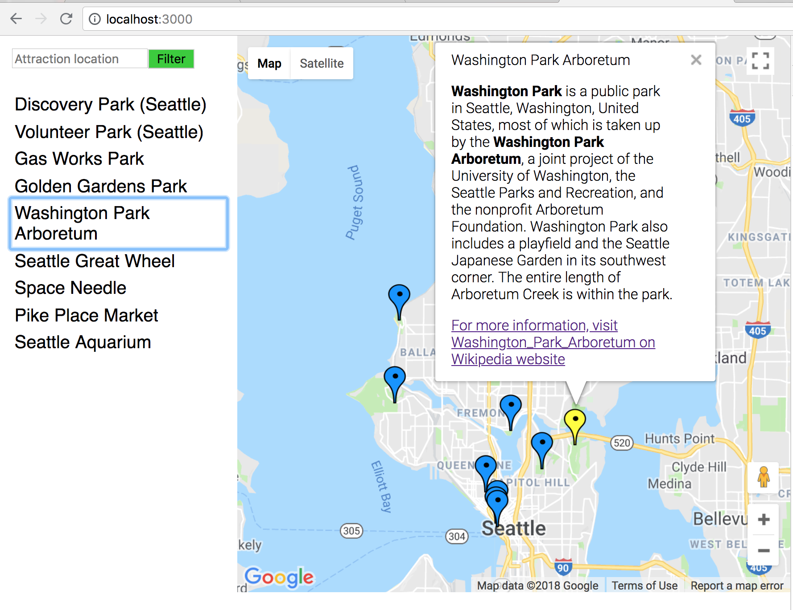

# React Neighborhood map



This is a single page app that features a map with attractions in Seattle. It uses [React library](https://reactjs.org/) as UI management and incorporates [Google Map API](https://cloud.google.com/maps-platform/) and [MediaWiki API](https://www.mediawiki.org/wiki/API:Main_page) that provide a map and locations data sets. Users can drag through the map and click on a blue marker of an attraction for more information. They can also use a keyword search to filter these locations. Run this app to find more!

## How to test

1. run `npm start`
2. open a browser and head for `localhost:3000`

## How to build and deploy

1. run `npm run build` and you are ready to deploy the app
2. Several method can be used for deploying. For a simple static server deployment, run
```
npm install -g serve
serve -s build
```
for more information, see [React deployment](https://github.com/facebook/create-react-app/blob/master/packages/react-scripts/template/README.md#deployment)

3. open a browser and head for `localhost:5000`

## Note:
service worker is only working under production mode, which means you have to deploy the app to show its powerfulness.
